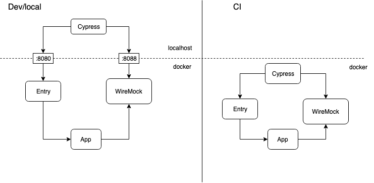

# UI testing with cypress

_the post is written by [@nik-kor](https://github.com/nik-kor) and [@ngenerio](https://github.com/ngenerio)_

## Introduction

In this post, we'd like to tell about our initial intentions for building it and show what we've got at the end.

So, in the beginning, we wanted to introduce a new framework for e2e testing for our QA and replace an old one. Our
QA-engineers use Selenium and Java for automation - which makes it harder to collaborate with developers who mostly use
other languages. Test coverage is far from 'good enough', the tests become outdated often, the developers don't usually
run them because they seem too hard to run locally.

Our proposal included using JS as the most ubiquitous language in the company and Cypress as a modern alternative to
Selenium.  In this configuration, developers can work together with QA-engineers improving test infrastructure, share
libraries and write test cases. Which leads to better tests code quality, closer collaboration between QA and dev
people - which is great.

It hasn't happened so far - there are the reasons why. But we've got something valuable for us as developers anyway.

## Technical details

## Technical details

As you can see from the image above we've got 2 different environments for running our tests. We try to run everything
inside Docker containers but it makes sense to run cypress client in a non-headless browser locally to get all the
benefits from their great UI(more about it later).  So let's walk through all the components on the picture:

* [Cypress](https://www.cypress.io/) - for local development we run it on the host, for CI builds it runs inside the
docker for the reason mentioned above.
* [Wiremock](http://wiremock.org/) - we configure the mocks before each test case using its
[rest api](http://wiremock.org/docs/api/). WM is a good, highly configurable, quite popular tool for mocking HTTP
protocol but cypress also has [stubbing](https://docs.cypress.io/guides/guides/network-requests.html#Stubbing) from the
box. So the reason we have WM is that we need mocks in the browser and on the server, otherwise I'd use the cypress
stubs - it's easier to set things up and faster.
* `Entry` container is used as a reverse proxy. Again it is for our particular need because we keep all the apps in
one project and need a router in front. But that might be avoided for simpler configuration - so the requests can go
directly to the `Dev` container
* `Dev` container contains our application

[cypress-cucumber-preprocessor] (https://github.com/TheBrainFamily/cypress-cucumber-preprocessor) allows writing the
test scenarios in gherkin syntax - which we find quite convenient.

### Cypress

What we really love in Cypress is that it allows us to do TDD with high-level tests. The tests runner is fast enough -
so we can partially skip some unit-tests. Another great thing is that you can debug the tests right inside the browser
with the devtools console.

Imho it's absolutely fine to use Cypress for e2e testing but there is a limitation that it works only in Chrome for now.

### CI

We stuck to [Concourse](https://concourse-ci.org/) as a company-wide solution for CI/CD and had to use it.
And for us it was more or less easy to do - so far we use docker extensively. We had to run our task in DIND image to
be able to run docker inside docker but that's another story.

But we'd like to mention [cypress-dashboard](https://www.cypress.io/dashboard/) - we haven't used it yet but seems like
it can be a great alternative and an approach that simplifies collaborations.

## Problems we encounter

* Cypress cannot run headless chrome - it uses some electron custom browser for it - there is an
[open issue](https://github.com/cypress-io/cypress/issues/832) at the moment. It potentially can lead to hard-to-debug
issues
* Unfortunately, it supports only Chrome - so again might not be a fully-functional replacement for selenium stack
* It took us quite some time and effort to set up the pipeline but it really depends and it might be that our solution
is overcomplicated

## Recap

* Cypress is a fantastic tool for higher-level testing and local development. We're happy to discover it even if our
initial goal to use it for e2e tests wasn't fullfilled
* Makes sense to use cypress's features fully so it might simplify the setup
